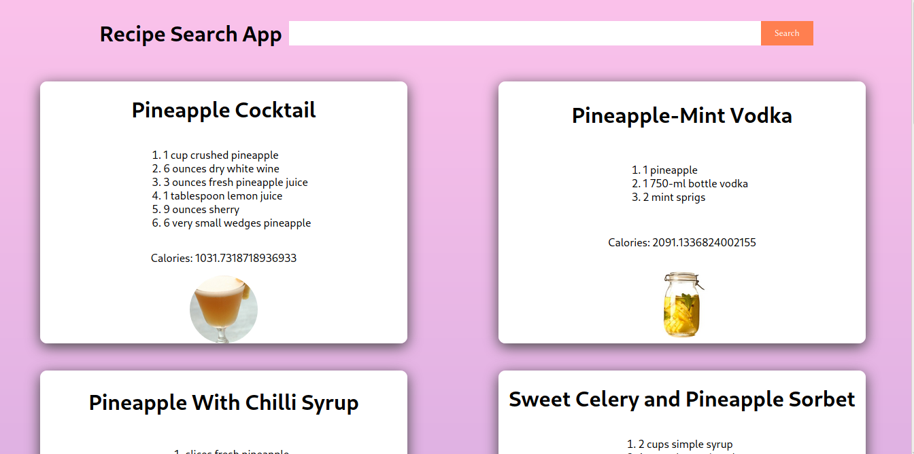
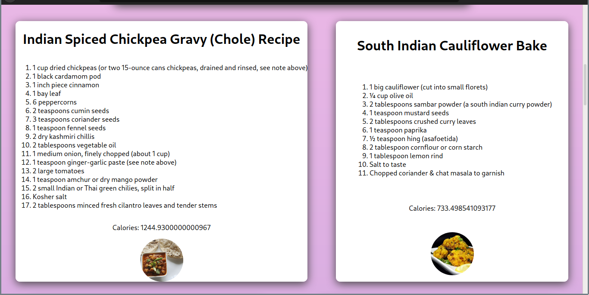

# Recipe App

This project was boostrapped using `create-react-app`. I used [Edamam's Recipe search API](https://developer.edamam.com/edamam-recipe-api), to fetch the information.

## Images from the app

## Credits

This project was based off the YouTube tutorial from Dev Ed which you can view [here](https://youtu.be/U9T6YkEDkMo)
